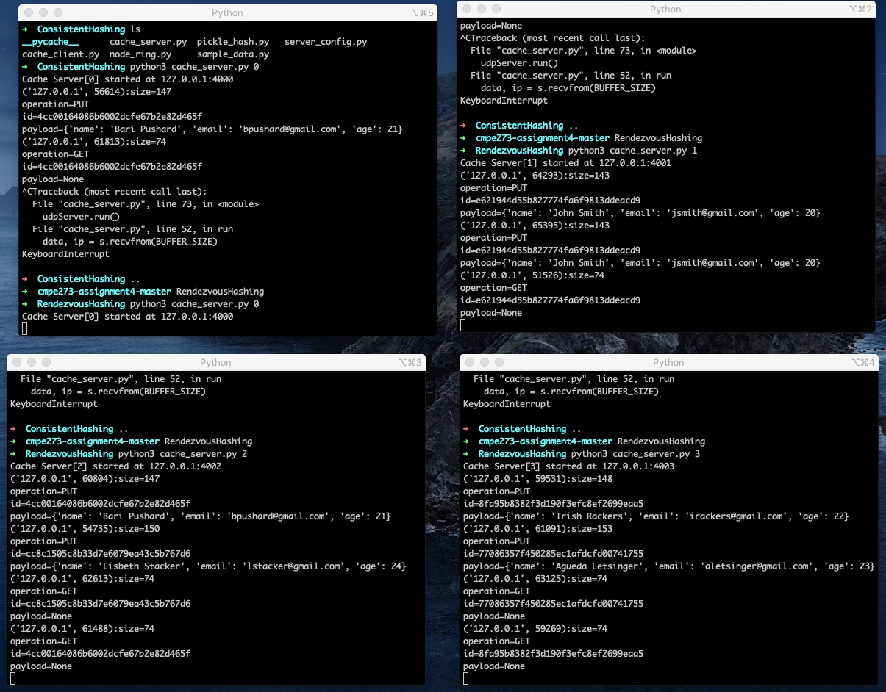
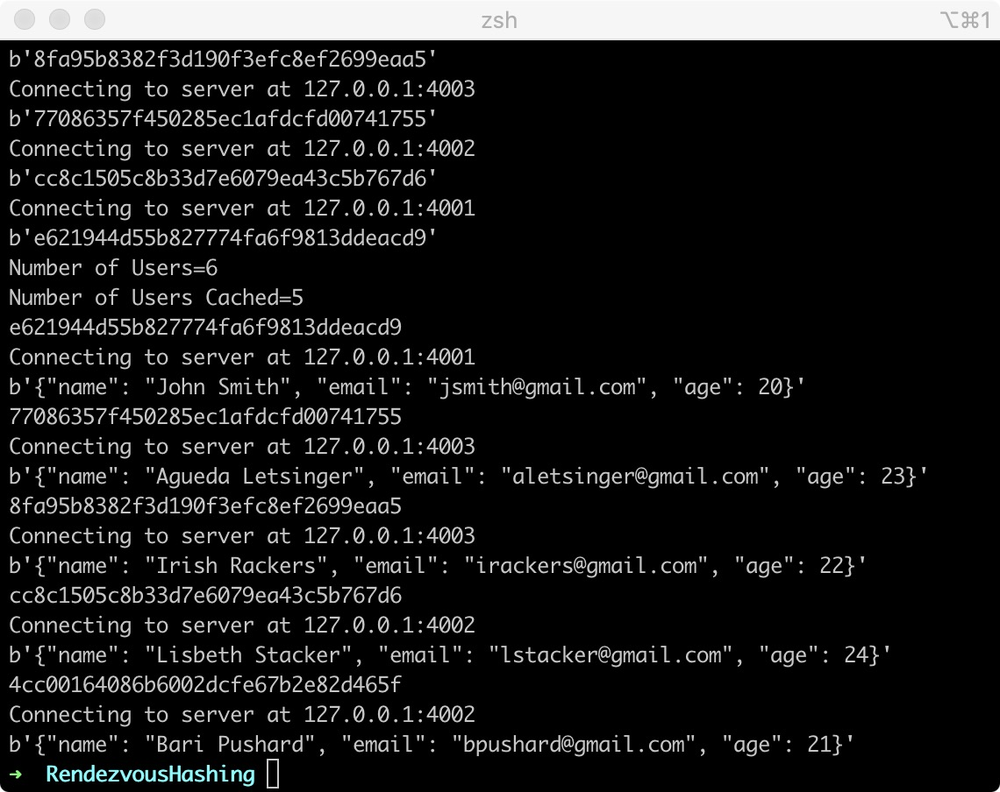
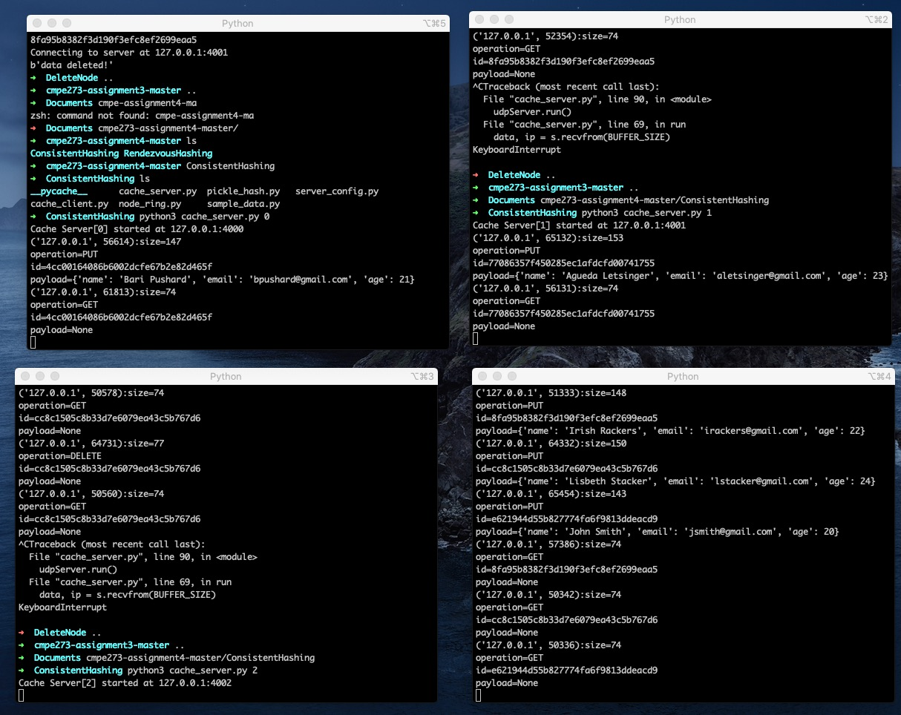
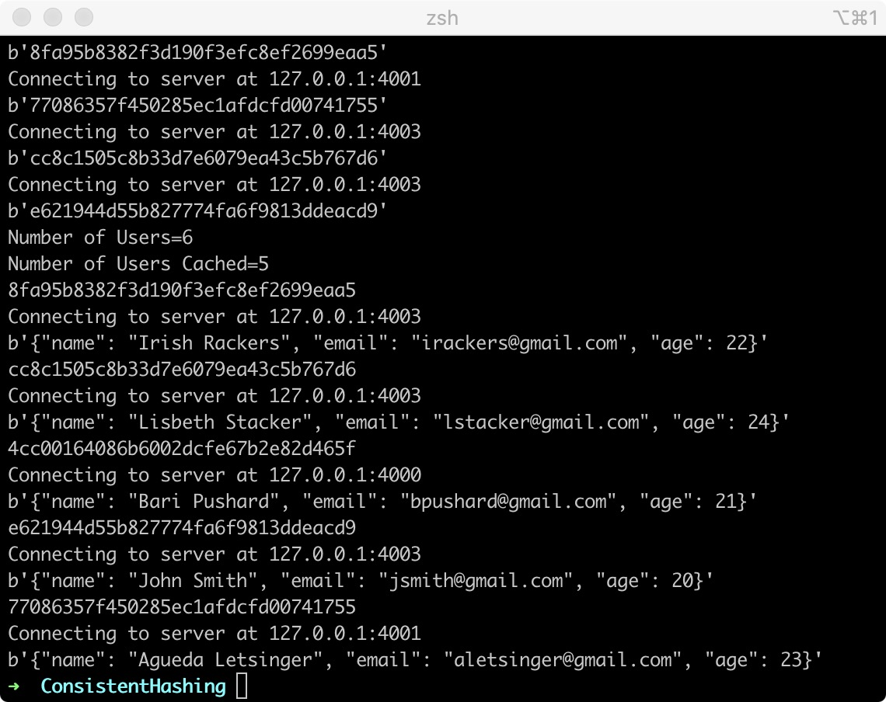

# cmpe273-assignment4

## Implement Rendezvous hashing to shard the data.
### server output

### client output

## Implement consistent hashing to shard the data.

## Features:
## Add virtual node layer in the consistent hashing.
## Implement virtual node with data replication.

### server output

### client output

